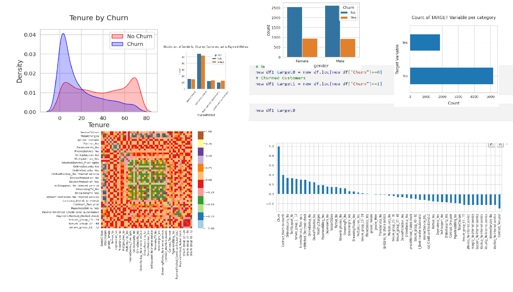

# Analytics Projects

This repository contains the projects on data analytics using Python, SQL, etc. 

1. **EDA Project using Python** which analyses the customer churn rate of a telcommunication company. It takes into account various parameters for the analysis, and takes the help various libraries like **Pandas, Numpy, Matplotlib and Seaborn** for the analysis of the data. 